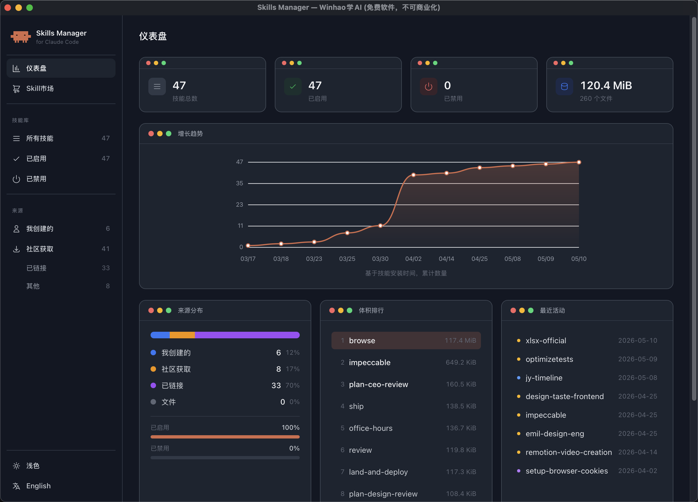
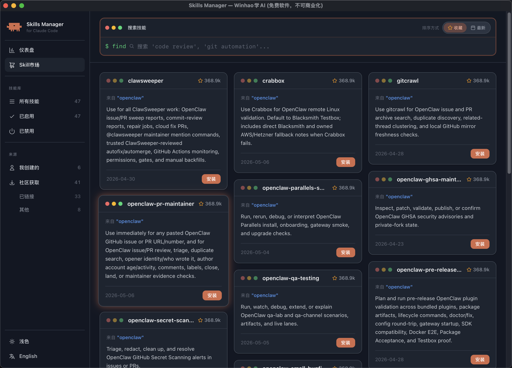
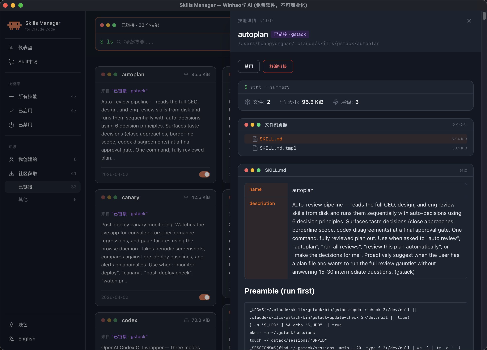

<div align="center">

# SkillBox

**Claude Code Skills 可视化管理工具**

浏览 · 搜索 · 启用/禁用 · 导入导出 · 在线市场 — 一站式管理你的 Claude Code 技能包

[](https://creativecommons.org/licenses/by-nc-nd/4.0/)
[](#下载)
[](#免责声明与版权)

<br/>


<br/>



</div>

> **本软件完全免费，仅供个人学习和非商业用途。严禁任何形式的商业化行为，包括但不限于出售、收费分发、嵌入付费产品等。**
>
> 作者：**Winhao学AI**（抖音搜索同名，抖音号：**54927876676**）
>
> 如果你是花钱买到的这个软件，你被骗了，请举报卖家。

## 功能

- 可视化管理 [Claude Code](https://docs.anthropic.com/en/docs/claude-code) 的所有 Skills（技能包）
- 自动扫描 `~/.claude/skills/` 目录，实时监控文件变化
- 一键启用/禁用 Skill，无需手动操作文件系统
- 连接 [Skill 在线市场](https://skillsmp.com)，搜索并一键下载社区 Skills
- 支持 `.zip` 格式的 Skill 导入与导出
- 仪表盘统计：数量趋势、来源分布、体积排行、最近活动
- 按名称 / 描述全文搜索，按来源和状态分类筛选
- 深色 / 浅色主题切换
- 中文 / English 双语界面

<div align="center">

&nbsp;&nbsp;&nbsp;&nbsp;


<sub>左：Skill 网格视图（卡片浏览 / 分类筛选） &nbsp;|&nbsp; 右：Skill 在线市场（搜索 / 一键下载）</sub>

<br/><br/>



<sub>Skill 详情面板：frontmatter 元数据 / 文件目录结构 / Markdown 正文渲染</sub>
</div>

## 下载

从 [Releases](../../releases) 页面下载：

| 平台 | 文件 |
|------|------|
| macOS | `SkillBox.dmg` |
| Windows | `SkillBox-Windows.zip` |
| Linux | `SkillBox-Linux.tar.gz` |

## 安装

### macOS

1. 下载 `SkillBox.dmg`，双击打开
2. 将 `SkillBox.app` 拖入「应用程序」文件夹
3. 首次打开如果提示"已损坏"，在终端执行：
   ```bash
   xattr -cr /Applications/SkillBox.app
   ```
4. 双击打开即可

### Windows

1. 解压 `SkillBox-Windows.zip`
2. 确保 `SkillBox.exe` 和 `WebView2Loader.dll` 在同一目录
3. 双击 `SkillBox.exe` 运行
4. 首次运行如果触发 Windows Defender 警告，选择「仍然运行」

### Linux

1. 解压 `SkillBox-Linux.tar.gz`
2. 运行 `./skillbox`

## 首次使用

### 前提条件

需要已安装 [Claude Code](https://docs.anthropic.com/en/docs/claude-code)（即 `~/.claude/` 目录已存在）。

### 使用步骤

1. **打开应用** — 自动检测 `~/.claude/` 目录，扫描 `~/.claude/skills/` 下所有 Skills
2. **浏览 Skills** — 在网格视图中以卡片形式查看所有已安装的 Skills
3. **筛选** — 使用侧边栏按来源（我创建的 / 社区获取 / 已链接）或状态（已启用 / 已禁用）筛选，使用搜索栏全文检索
4. **查看详情** — 点击卡片打开详情面板，查看 frontmatter 元数据、文件结构和 Markdown 正文
5. **启用/禁用** — 在详情面板中一键切换 Skill 状态
6. **从市场安装** — 切换到「Skill 市场」页面，搜索并下载社区 Skills
7. **导入 Skill** — 点击「上传」按钮，选择 `.zip` 文件导入
8. **导出 Skill** — 在详情面板中将 Skill 导出为 `.zip` 文件，方便分享

> **提示：** 应用会实时监控 Skills 目录变化，在 Claude Code 中安装或删除 Skill 后，界面会自动刷新。

## 构建

需要 Rust 工具链和 Node.js：

```bash
# 克隆项目
git clone <repo-url>
cd manage-skills

# 安装 Dioxus CLI
cargo install dioxus-cli

# 安装前端依赖（Tailwind CSS）
npm install

# 编译 Tailwind CSS（保持后台运行）
npx tailwindcss -i input.css -o assets/main.css --watch &

# 开发运行
dx serve --platform desktop

# 生产构建
dx build --release --platform desktop
```

## 项目结构

```
manage-skills/
├── src/
│   ├── main.rs                   # 入口，桌面窗口配置
│   ├── app.rs                    # 根组件
│   ├── routes.rs                 # 路由定义
│   ├── theme.rs                  # 主题与国际化 (i18n)
│   ├── components/
│   │   ├── dashboard.rs          # 仪表盘视图
│   │   ├── skill_grid.rs         # Skill 网格视图
│   │   ├── skill_card.rs         # Skill 卡片组件
│   │   ├── skill_detail.rs       # Skill 详情面板
│   │   ├── skill_drawer.rs       # Skill 抽屉组件
│   │   ├── marketplace.rs        # Skill 市场页面
│   │   ├── marketplace_drawer.rs # 市场详情抽屉
│   │   ├── sidebar.rs            # 侧边栏导航
│   │   ├── search_bar.rs         # 搜索栏
│   │   ├── skill_form.rs         # Skill 创建/编辑表单
│   │   ├── upload_dialog.rs      # 导入对话框
│   │   └── ...
│   ├── hooks/
│   │   └── use_skills.rs         # Skills 状态管理 Hook
│   ├── models/
│   │   ├── skill.rs              # Skill 数据模型
│   │   └── frontmatter.rs        # YAML frontmatter 解析
│   └── services/
│       ├── scanner.rs            # 文件系统扫描与监控
│       ├── skill_io.rs           # Skill 导入/导出/启用/禁用
│       ├── marketplace.rs        # 市场 API 客户端
│       └── markdown.rs           # Markdown 渲染服务
├── assets/                       # 静态资源 & 编译后的 CSS
├── Cargo.toml                    # Rust 依赖
├── Dioxus.toml                   # Dioxus 配置
├── input.css                     # Tailwind 入口 CSS
├── tailwind.config.js            # Tailwind 配置
└── package.json                  # Node 依赖 (Tailwind)
```

## 技术栈

| 层次 | 技术 |
|------|------|
| 语言 | Rust |
| UI 框架 | [Dioxus](https://dioxuslabs.com/) 0.7 (Desktop) |
| 样式 | Tailwind CSS 3 |
| 序列化 | serde + serde_yaml + serde_json |
| Markdown 渲染 | pulldown-cmark + ammonia (XSS 防护) |
| HTTP 客户端 | reqwest + tokio |
| 文件监控 | notify |
| 打包/解压 | zip |

## 免责声明与版权

- 本软件由 **Winhao学AI**（抖音搜索同名，抖音号：**54927876676**）开发并免费提供
- **完全免费，不可商业化** — 禁止任何形式的售卖、收费分发、打包进付费产品
- 欢迎免费转发分享，但必须保留原始作者信息，不得篡改或移除软件内的水印和版权声明
- 如发现有人售卖本软件，请联系作者举报

## 许可证

本项目采用 [CC BY-NC-ND 4.0](https://creativecommons.org/licenses/by-nc-nd/4.0/) 许可证 — 署名-非商业性使用-禁止演绎。

- **署名**：必须注明原作者（Winhao学AI）
- **非商业性使用**：不得用于任何商业目的
- **禁止演绎**：不得修改后再分发（防止去除水印后转卖）
